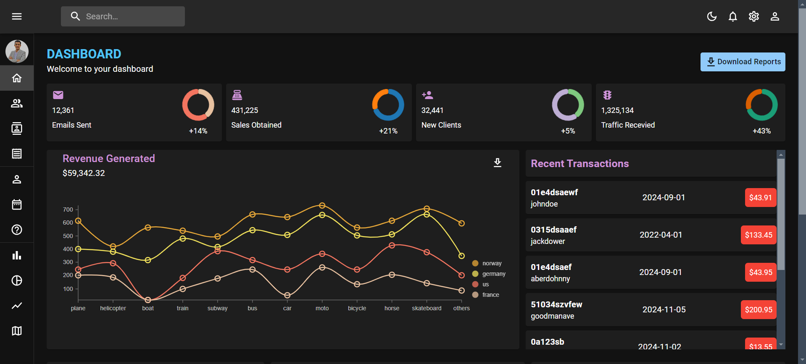
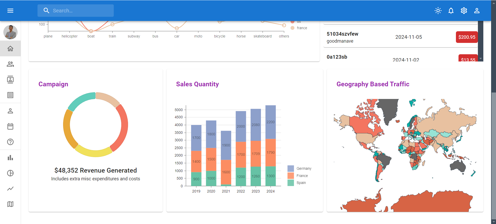
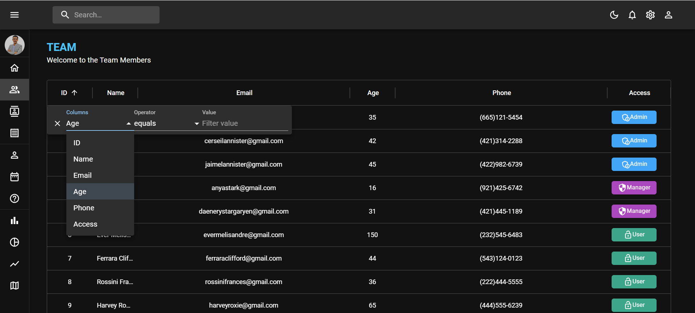
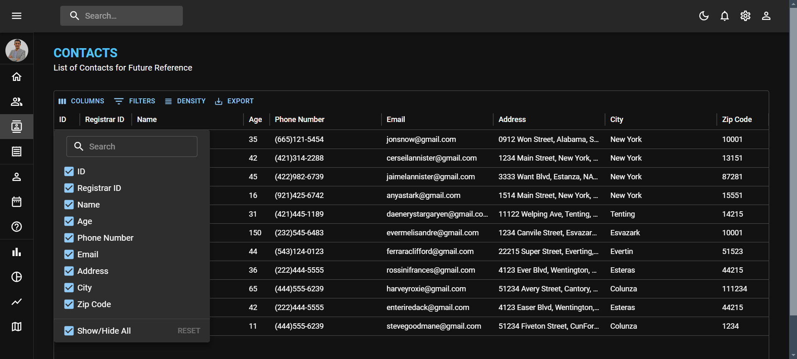
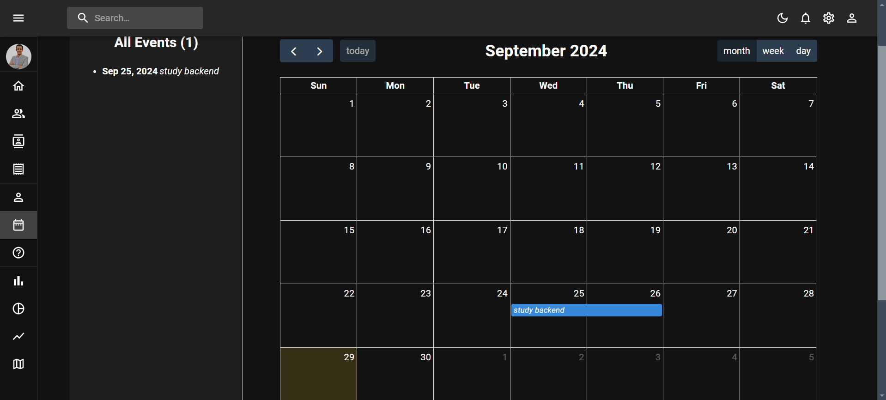
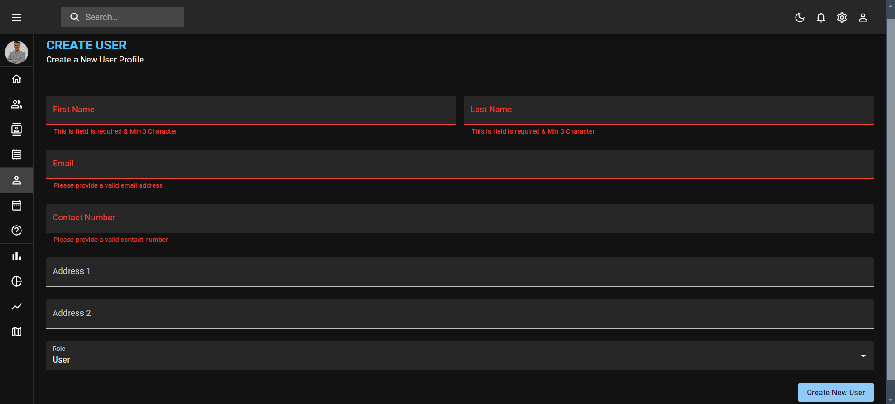
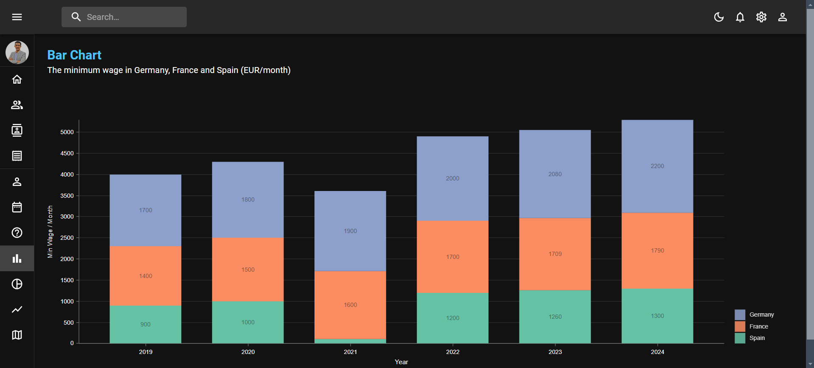
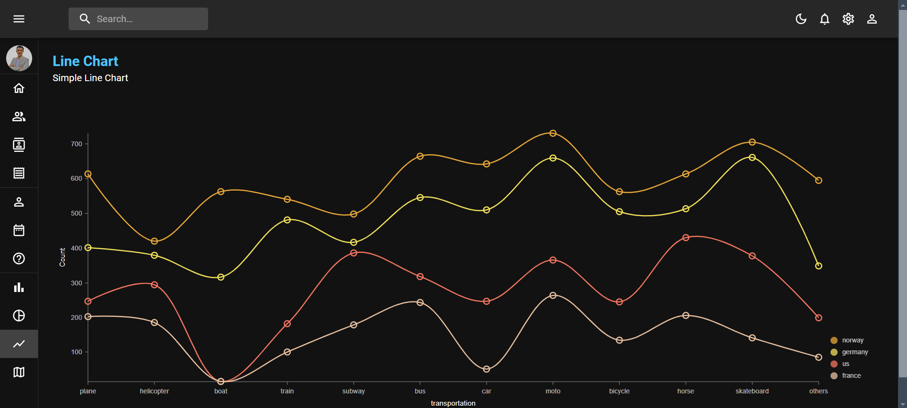
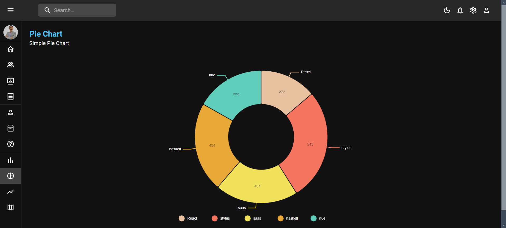
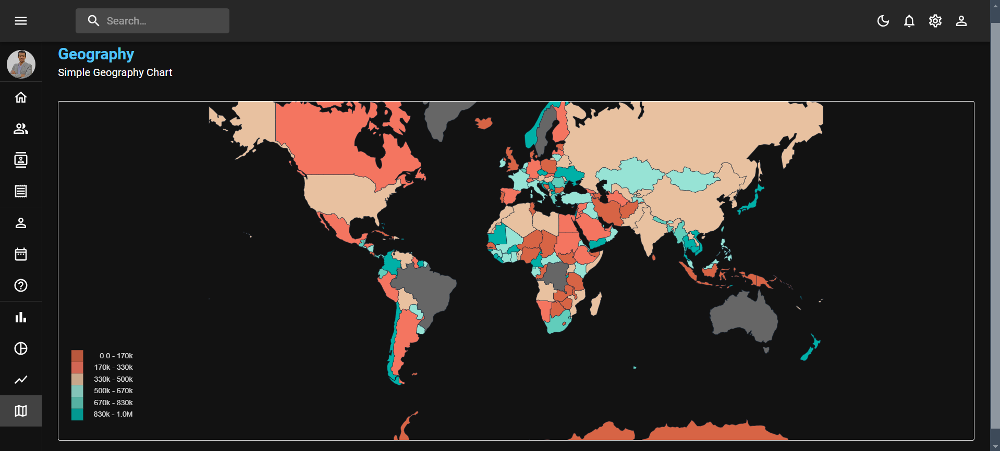

# Todo-list Application 🙌

Admin Dashboard website is a frontend application built using React with Vite as the bundler. It incorporates Material UI for components, offering a sleek and modern user interface. This dashboard simplifies data handling while offering flexibility and scalability, streamline user management and data administration tasks. In addition to that dynamic table and charts views, and filtering options, this dashboard is an essential tool for efficient resource management Furthermore.
Currently, two official plugins are available:

## 🌟 [Live Website](https://admin-dashboard-52b2d.firebaseapp.com/) 🌟

## Table of Contents

- [Technologies Used](#technologies-used)
- [Screenshots](#screenshots)
- [Installation](#Installation)
- [Contact](#contact)
  
## Technologies Used
1. **[React](https://react.dev/learn):** Utilized for building the frontend interface, providing dynamic and interactive components.
2. **[Vite](https://vitejs.dev/guide/):** Employed as the build tool to optimize and bundle the project for production.
3. **[Material UI](https://mui.com/material-ui/getting-started/installation/):** Leveraged for pre-designed components and UI elements, facilitating rapid development and maintaining consistency in design.
4. **[React Router DOM](https://reactrouter.com/):** Utilized for managing application routing, enabling dynamic navigation and seamless user experience across different views.
5. **[React Hook Form](https://react-hook-form.com/):** Implemented for managing form state and validation, simplifying form handling and enhancing performance with minimal re-renders.
6. **[Nivo](https://nivo.rocks/):** Employed for creating interactive and responsive charts, providing powerful data visualization capabilities to enhance user insights. 
7. **[FullCalendar](https://fullcalendar.io/):** Integrated for displaying and managing events in a calendar format, enabling users to visualize schedules and appointments easily.
8. **[Firebase](https://firebase.google.com/?hl=en):** Utilized for hosting and deploying the project, providing a reliable platform for delivering the application to users.

## Screenshot






















## Installation

1. Clone the repository:
   ```bash
   git clone https://github.com/Mmostafa1999/Todo-list.git

2. Install dependencies:
   ```bash
   npm install

3. Run the development server:
   ```bash
   npm run dev

Feel free to contribute or report issues!

## Contact
- [Author](https://github.com/Mmostafa1999)
- [Email](mahmoud.mostafa4467@gmail.com)
- [Linkedin](https://www.linkedin.com/in/mahmoud-mustafa-642434188/)
